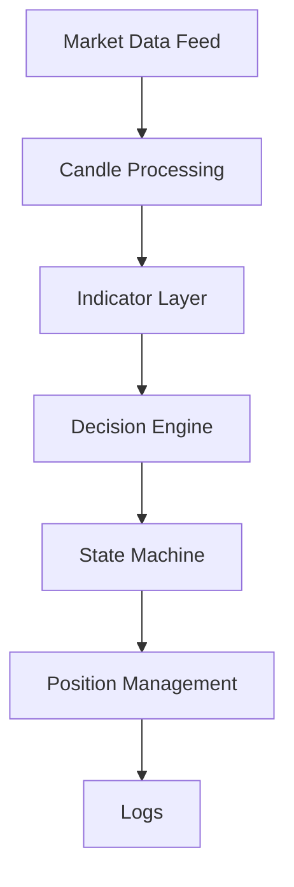
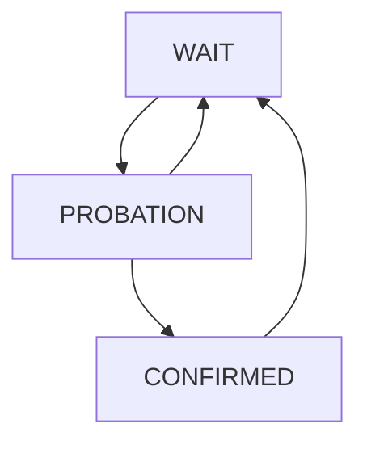

TAlgo

//Overview

--> TAlgo is a rule-based trading decision system built to reduce emotional bias (fear, greed, revenge trading) in live markets.

--> The goal is to replace emotional trading with structured decision logic.

//The project focuses on:

--> Decision consistency

--> Behavior during market transitions

--> Learning from failures through iteration

--> Explainability using logs

//This repository documents the evolution of the algorithm, version by version, showing what worked, what failed, and why changes were made.

> Logic > Emotion

---

Algorithm Evolution

---

v01 — Raw Candle Logic

//Objective

--> Build the simplest automated decision rule.

//Logic

--> Candle closes higher → BUY

--> Candle closes lower → SELL

//Outcome

--> Too many false signals

--> Extremely sensitive to market noise

--> Not usable in live markets

//Learning

--> Raw price action alone is unreliable.

---

v01.1 — Heikin Ashi Smoothing

//Objective

--> Reduce market noise using smoothed candles.

//Logic

--> Convert candles to Heikin Ashi

--> Apply same logic as v01

//Outcome

--> Smoother signals

--> Still fails badly in sideways markets

//Learning

--> Smoothing reduces noise but does not solve consolidation.

---

v02 — HMA Trend Detection

//Objective

--> Capture trend direction more clearly.

//Logic

--> Close > HMA → BUY

--> Close < HMA → SELL

//Outcome

--> Faster trend detection

--> Frequent flip-flopping during sideways markets

//Learning

--> Trend indicators fail without market context.

---

v03 — High / Low Zone Logic

//Objective

--> Divide the market into trend and transition zones.

//Logic

--> Buy above HMA High

--> Sell below HMA Low

--> Wait / hedge inside the zone

//Outcome

--> Reduced false signals

--> Hedging slowed recovery during trends

//Learning

--> Hedging protects but delays re-entry.

---

v03.1 — EMA Stability Layer

//Objective

--> Improve signal stability.

//Logic

--> EMA used for trend confirmation

//Outcome

--> Fewer whipsaws

--> Entries and exits became slower

//Learning

--> Lag increases stability but hurts transitions.

---

v04 — EMA + ALMA Transition Logic

//Objective

--> Improve behavior during trend shifts.

//Logic

--> EMA for trend direction

--> ALMA for smoother breakout boundaries

//Outcome

--> Improved stability

--> Still weak during sharp sideways markets

//Learning

--> Handling transitions is the hardest problem in trading systems.

---

v05 — ALMA Breakout Study

//Objective

--> Observe pure breakout behavior.

//Logic

--> Buy above ALMA High

--> Sell below ALMA Low

--> No stop loss

--> No hedging

//Outcome

--> Clean trend signals

--> Losses during market transitions

//Learning

--> Transition losses are unavoidable and must be understood.

---

v05.1 — ALMA Confirmation Zone

//Objective

--> Reduce false trades in sideways markets.

//Logic

--> Buy only above ALMA band

--> Sell only below ALMA band

--> No trading inside band

//Outcome

--> Fewer trades

--> Reduced overtrading

//Learning

--> Explicit transition zones improve decision consistency.

---

v06 — Session Aware Decision Engine

//Objective

--> Introduce session awareness and explainable behavior.

//Features

--> Session tracking

--> PnL monitoring

--> Cooldown after losses

--> Structured logging

//Outcome

--> System behavior became observable and explainable.

//Learning

--> Trading engines need context about session state.

---

v07 — Dynamic Trend Commitment

//Objective

--> Capture larger profits during strong trends.

//Logic

--> Breakout entry starts with 1 lot

--> Add more lots after trend confirmation

//Outcome

--> Strong trends captured more effectively

//Learning

--> Markets reward commitment after confirmation.

---

v08 — Stability Reinforcement Layer

//Objective

--> Reduce losses during sideways compression.

//Logic

--> Measure ALMA band width

--> Exit trades when band compresses

//Outcome

--> Reduced losses during sideways markets

--> More stable PnL behavior

//Learning

--> Stability is more important than aggressiveness.

---

v09 — Context-Aware Attack Logic

//Objective

--> Scale positions only when real momentum exists.

//Logic

--> Introduce state machine:

WAIT → PROBE → ATTACK

--> Probe entry with small size

--> Add lots only if:

--> EMA slope confirms trend

--> ALMA bandwidth expands

//Outcome

--> Reduced premature scaling

--> Smarter breakout commitment

//Learning

--> Volatility expansion confirms market intent.

---

v10 — Structured Breakout Engine

//Objective

--> Build a clean and explainable breakout system.

//State Machine

WAIT → PROBATION → CONFIRMED

//Logic

--> Breakout entry begins with 1 lot

--> Confirmation adds additional lot

--> Exit on pullback inside ALMA boundary

//Features

--> Structured logging

--> Session lifecycle handling

--> Clear decision phases

//Outcome

--> Stable breakout execution engine

--> Behavior easily observable in logs

//Learning

--> Structured decision phases improve discipline.

---

Development Philosophy

TAlgo evolves through:

--> Real market observation

--> Iterative improvements

--> Behavioral analysis

--> Continuous refinement

The goal is not just profitability, but consistent and explainable decision making.

---

Core Principle

Logic > Emotion

---

